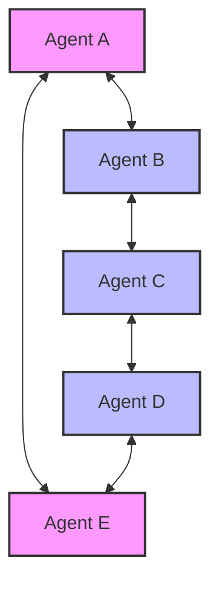

# System Architecture

PHOENIX is designed as a pure peer-to-peer system. This section outlines the high-level components and data flow.

## High-Level Diagram

*   **Agents (Nodes)**: Every participant in the network is equal. There are no special "servers" or "clients".
*   **Mesh Network**: Nodes connect to a limited number of peers (max 5) to form a resilient graph.

## System Components

### 1. Node (`pkg/node`)
The core struct that initializes the p2p host. It manages:
*   **Identity**: Ed25519 keypair generation and storage.
*   **Transport**: Configuring TCP, WebSocket, and other transports.
*   **NAT**: Handling UPnP and NAT-PMP port mapping.

### 2. Peer Manager (`pkg/node/peer_manager.go`)
Responsible for maintaining a healthy connection count.
*   **Limit**: Enforces a strict maximum of 5 peers.
*   **Logic**: Rejects incoming connections if full; drops old connections if necessary (depending on strategy).
*   **Purpose**: Keeps the network traffic footprint small and hard to detect.

### 3. Discovery (`pkg/discovery`)
How nodes find each other.
*   **mDNS**: Multicast DNS for finding peers on the same LAN (zero-config).
*   **DHT** (Planned): Kademlia DHT for finding peers across the internet without central trackers.

### 4. Protocol (`pkg/protocol`)
Defines the wire format for messages. PHOENIX uses a custom binary or JSON-based protocol over libp2p streams.
*   **ID**: `/mesh-c2/1.0.0`
*   **Payloads**: Wrapped in envelope structures with routing metadata (TTL, Source, Target).

### 5. Command Execution (`pkg/command`)
Safely executes instructions received from the network.
*   Executes shell commands.
*   Captures `stdout` and `stderr`.
*   Returns the result as a response message to the original sender.
