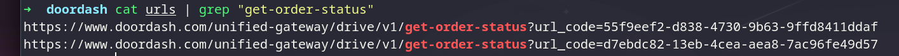

# From JavaScript Recon to PII Exposure

## TL;DR

While reviewing client-side code and JavaScript assets, I first came across an order-status endpoint that returned sensitive tracking data and PII, but only when called with a high-entropy url_code (`d7ebdc82-13eb-4cea-aea8-7ac96fe49d57`).

After digging deeper in the source code and related request logic, I discovered the same endpoint also accepted a numeric, incremental tracking_number. Unlike url_code, this identifier was guessable, it returned the same full response payload. That made it possible to disclose other customers’ data without authentication, including exact location (lat/long), phone numbers, and personal details. I also identified a debug-related parameter that expanded the response and exposed additional customer fields. The issue has been reported and patched.

## Recon: Finding an Additional API Base
I started with **source code review** and asset discovery:

* Enumerated JS files and endpoints using `urlfinder` and `gau`.
* Parsed JavaScript bundles to identify configuration objects and request wrappers that revealed an additional API base and route patterns.

I used a regex to extract candidate URLs/endpoints from JS, then filtered the results to “API-looking” paths
## Discovery: An Endpoint Returning Sensitive Data


Among the extracted endpoints, one stood out: an order status route that returned rich tracking details. The response contained fields that looked like PII and operational delivery metadata (for example: location coordinates and delivery-related identifiers).

At first, the primary parameter to access the order appeared long/high-entropy, which made direct guessing impractical. I attempted light parameter analysis and fuzzing focused on obvious variations, but did not find additional behavior that way.

## The Break: A Debug Parameter in Source


Returning to the source, I searched specifically for:

* The endpoint name/path
* References to “debug”, “verbose”, “trace”, “test”, “dev”, “include*”, “expand”, etc.
* Conditional logic around response shaping

That led me to a debug-related parameter `tracking_number` that changed the server response and caused it to return significantly more sensitive customer information. 
The most important part is that `tracking_number` was numeric and incremental (brute-forceable), not a high-entropy value. That meant anyone could iterate values (1111, 1112, 1113, …) and each request would return order data for a different customer without authentication.

samples:
```
https://www.doordash.com/unified-gateway/drive/v1/get-order-status?tracking_number=1118

https://www.doordash.com/unified-gateway/drive/v1/get-order-status?tracking_number=1119

https://www.doordash.com/unified-gateway/drive/v1/get-order-status?tracking_number=1120
```

## Root Cause (What went wrong)

The core design issue was that the service accepted multiple selectors for the same resource:

* One selector was intended to be unguessable/high-entropy.
* Another selector (or mode) effectively weakened access control and returned the same sensitive payload without requiring authorization.

In short: **the API did not enforce object-level authorization** before returning sensitive order/customer/dasher data, and a debug pathway amplified the exposure.

## Impact

The exposed data included highly sensitive PII and delivery metadata, such as:

* Customer identity and address data
* Precise GPS coordinates (latitude/longitude)
* Courier/dasher identifiers and phone number
* Order identifiers and timestamps that could be correlated

## Lessons Learned

* JS bundles frequently reveal “hidden” gateway routes and optional parameters.
* Any endpoint returning PII must be reviewed for BOLA/IDOR risk, especially if it accepts multiple identifiers.
* Debug flags are common footguns. If you see them in client code, treat them as high-signal review targets.
